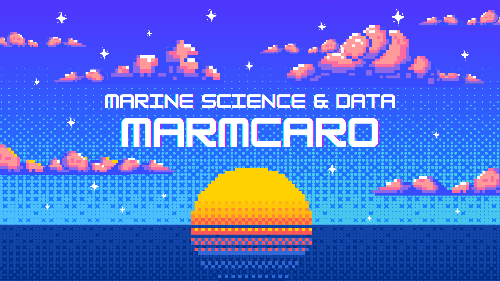

# 👋 ¡Hola! Mi nombre es Mar

  

  
  
  
  

  
  
  

  
  
  
  
  

---

# 🌊 Ciencia, Datos y Código | Repositorio Personal

Bienvenida/o a mi repositorio personal. Soy científica marina especializada en bioestadística, actualmente trabajando como científica de datos. Este espacio es mi bitácora digital: un lugar donde comparto recursos, código y reflexiones que combinan ciencia, programación y creatividad.

---

## 📂 ¿Qué encontrarás aquí?

* 📘 **Tutoriales** sobre análisis de datos, visualización, y más.
* 🧪 **Informes técnicos** y notebooks explicativos.
* 🧮 **Funciones personalizadas** en R y Python que uso en proyectos reales.
* 🐙 **Proyectos variados** relacionados con ciencia marina, estadística aplicada y ciencia de datos.

---

## 🛠️ Tecnologías principales

-  **R** (mi lenguaje principal)
-  **Python** (aprendiendo y explorando)

💻 *Lenguajes & Entornos*

  

📈 *Ciencia de Datos y Estadística*

              

  

📊 *Visualización de datos*

  

🗺️ *Herramientas de Análisis Espacial*

    

🗄️ *Bases de Datos*

  

*Colaboración y Control de Versiones*

    

---

## 💡 Filosofía

Este repositorio no pretende ser un portafolio perfecto. Es más bien un cuaderno de trabajo abierto donde documento lo que aprendo, construyo y descubro. Si algo te resulta útil, me alegra. Si algo se puede mejorar, bienvenida la sugerencia.

> *"Great things are not done by impulse, but by a series of small things brought together."*  
> — *Vincent van Gogh*

---

## 📬 Contacto

📎 Puedes encontrarme en [LinkedIn](https://www.linkedin.com/in/maria-del-carmen-martinez-caro-08b6001aa/)

---
